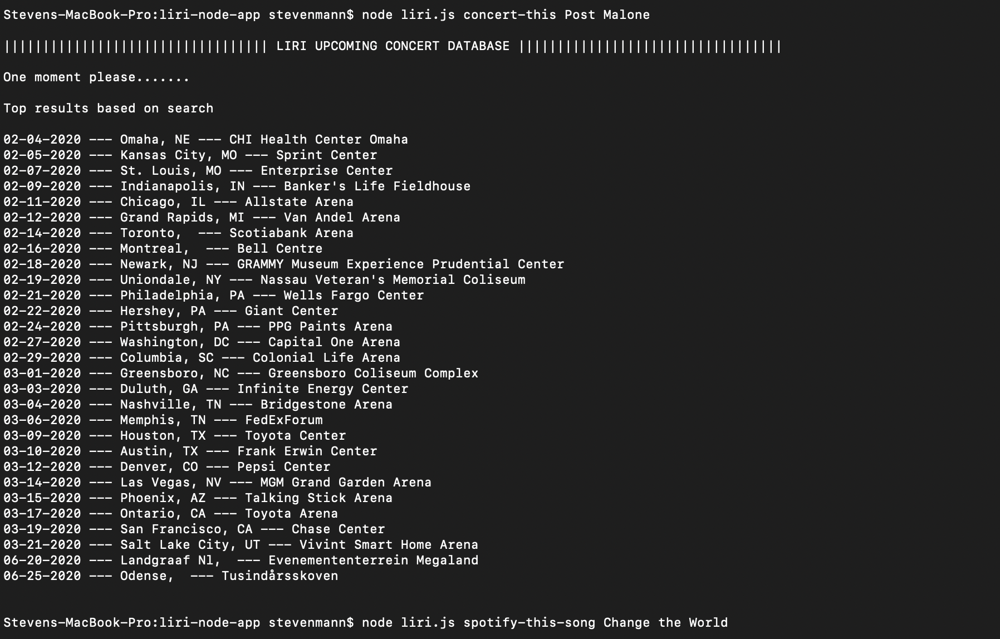
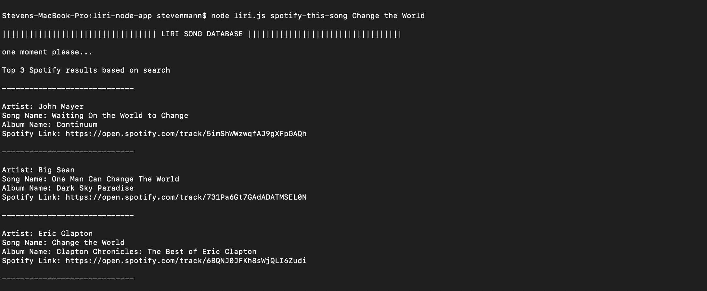
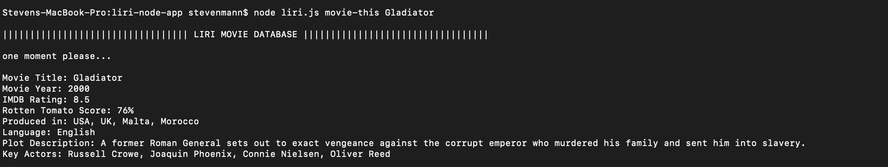

# liri-node-app
This is an assignment for unit 10 of the UT Coding Bootcamp where I will designed an application called Liri. Liri is a Language Interpretation and Recognition Interface. Liri will be a command line node app that takes in parameters and gives the user a response to the user request.

## Organization:

This application is organized using javascript files to contain the overall function of the application. liri.js contains the user experience functions, while keys.js contains keys to select APIS. I am also attatching an example.env file that will show the user how to add their own API keys to make the app functionable. 

## How-to-Guide:

* make sure node.js is installed on your local machine
* to use liri, first clone the respository to your local machine
* next navigate to the local file destination of the clone in your terminal
* run the command 'npm install' to install the required node packages for the application
* now your all set up to run the app! 
* type the following commands to run liri 'node liri.js (command here) (search keywords here)'
* you can run the following commands:
  * "concert-this" to view Bands in Town info on an artist
  * "movie-this" to view OMDB info on any given movie
  * "spotify-this-song" to run a spotify search

## Screenshots:

## Tech Used:

* Node.js
* Moment.js
* Javascript
* .env
* Spotify API, Bands in Town API, OMDB API

## My Role:

I developed this siri imitation app with instructions and parameters from the UT Coding Bootcamp

